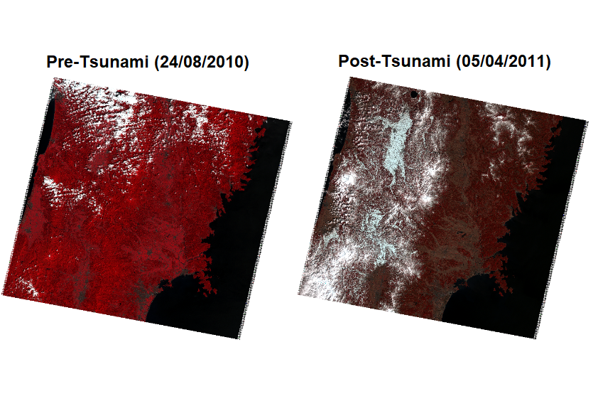
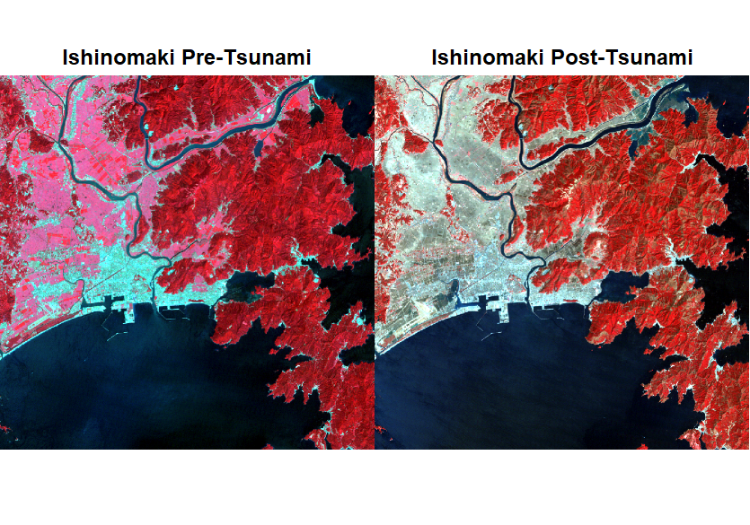
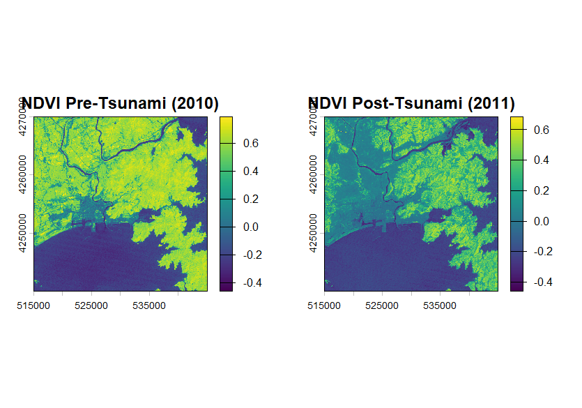
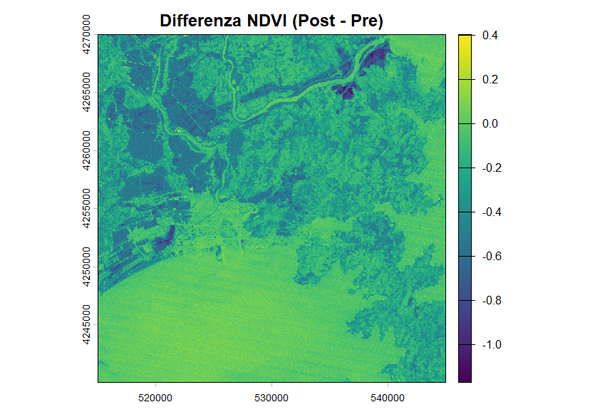
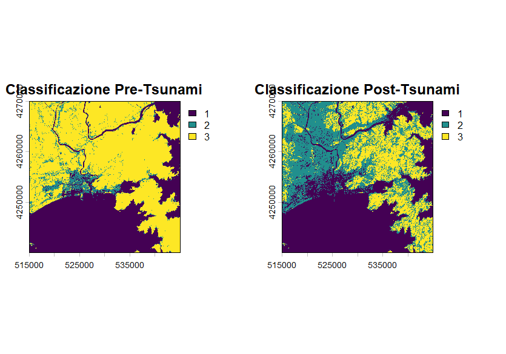
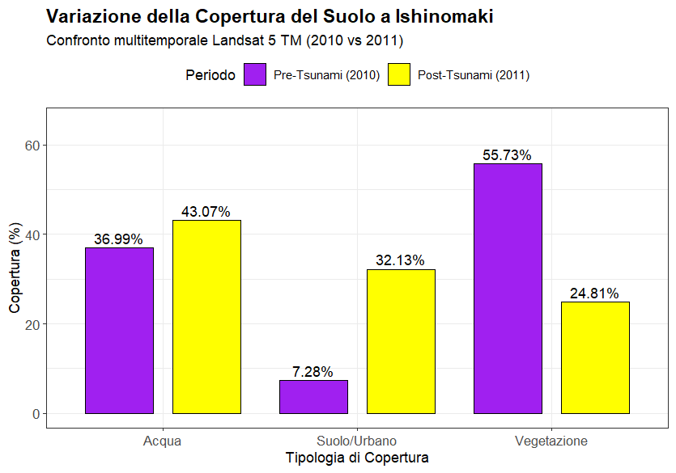

# 🌊 Analisi multitemporale di Ishinomaki
## Confronto Pre-Tsunami / Post-Tsunami con Landsat 5 TM

---

# 📌 Introduzione

Il presente progetto di telerilevamento analizza le variazioni della copertura del suolo nell'area di **Ishinomaki, Giappone**, attraverso il confronto tra due immagini satellitari **Landsat 5 TM** acquisite prima e dopo lo tsunami dell'11 marzo 2011.

Sono state utilizzate:

- **24/08/2010** → periodo pre-tsunami
- **05/04/2011** → periodo post-tsunami

L'analisi si concentra in particolare sulla variazione della vegetazione e sulla distribuzione delle principali categorie di copertura del suolo.

> [!IMPORTANT]
> Il confronto tra agosto 2010 e aprile 2011 deve essere interpretato tenendo conto anche della **differenza stagionale** tra le due acquisizioni. Le variazioni osservate non possono quindi essere attribuite esclusivamente allo tsunami.

---

# 🛰️ Obiettivo del progetto

L'obiettivo dell'elaborazione è valutare le variazioni del territorio di Ishinomaki mediante dati satellitari Landsat 5 TM.

In particolare, il progetto prevede:

- visualizzazione delle immagini Landsat;
- definizione dell'area di studio;
- calcolo dell'**NDVI (Normalized Difference Vegetation Index)**;
- confronto dei valori di NDVI tra 2010 e 2011;
- calcolo della differenza **ΔNDVI = NDVI post - NDVI pre**;
- classificazione dei valori di NDVI in tre macro-classi;
- calcolo delle percentuali di ciascuna classe;
- confronto grafico della copertura del suolo.

---

# 📁 Impostazione della working directory

La working directory corrisponde alla cartella contenente le immagini raster Landsat 5.

```r
setwd("C:/Users/LEONOVO-I3/Desktop/progetto telerilevamento")

getwd()

list.files(pattern = "\\.TIF$", ignore.case = TRUE)
```

---

# 📦 Caricamento dei pacchetti

```r
library(terra)        # Per lavorare con raster e immagini satellitari
library(imageRy)      
library(viridis)      # Palette di colori 
library(ggplot2)      # Pacchetto per la creazione di grafici 
```

Il pacchetto `terra` viene utilizzato per la gestione e l'analisi dei dati raster, mentre `imageRy` fornisce funzioni dedicate al telerilevamento. `viridis` viene utilizzato per le palette cromatiche e `ggplot2` per la realizzazione del grafico finale.

---

# 🛰️ Importazione delle bande Landsat 5

## Pre-Tsunami – 24/08/2010

```r
pre_b1 <- rast("LT05_L1TP_107033_20100824_20200823_02_T1_B1.TIF")
pre_b2 <- rast("LT05_L1TP_107033_20100824_20200823_02_T1_B2.TIF")
pre_b3 <- rast("LT05_L1TP_107033_20100824_20200823_02_T1_B3.TIF")
pre_b4 <- rast("LT05_L1TP_107033_20100824_20200823_02_T1_B4.TIF")

pre_stack <- c(pre_b1, pre_b2, pre_b3, pre_b4)

names(pre_stack) <- c("blue", "green", "red", "nir")
```

## Post-Tsunami – 05/04/2011

```r
post_b1 <- rast("LT05_L1TP_107033_20110405_20200823_02_T1_B1.TIF")
post_b2 <- rast("LT05_L1TP_107033_20110405_20200823_02_T1_B2.TIF")
post_b3 <- rast("LT05_L1TP_107033_20110405_20200823_02_T1_B3.TIF")
post_b4 <- rast("LT05_L1TP_107033_20110405_20200823_02_T1_B4.TIF")

post_stack <- c(post_b1, post_b2, post_b3, post_b4)

names(post_stack) <- c("blue", "green", "red", "nir")
```

---

# 🌐 Controllo del sistema di riferimento

```r
crs(pre_stack)
crs(post_stack)
```

Le immagini vengono controllate per verificare il sistema di riferimento spaziale prima delle elaborazioni successive.

---

# 🎨 Visualizzazione delle immagini Landsat

Per il primo confronto viene utilizzata una composizione a falsi colori **4-3-2**:

- B4 → NIR
- B3 → Red
- B2 → Green

```r
par(mfrow = c(1, 2))

plotRGB(
  pre_stack,
  r = 4,
  g = 3,
  b = 2,
  stretch = "lin",
  main = "Pre-Tsunami (24/08/2010)"
)

plotRGB(
  post_stack,
  r = 4,
  g = 3,
  b = 2,
  stretch = "lin",
  main = "Post-Tsunami (05/04/2011)"
)
```

<p align="center">

</p>

> **Commento**
>
> La composizione a falsi colori permette di confrontare visivamente l'area di Ishinomaki nei due periodi. L'utilizzo della banda NIR consente di evidenziare maggiormente la componente vegetazionale.

---

# 📍 Definizione dell'area di studio

L'area di studio viene definita attraverso un'estensione spaziale riferita all'area di Ishinomaki.

```r
ext_ishi <- ext(
  515000,
  545000,
  4240000,
  4270000
)

pre_crop <- crop(pre_stack, ext_ishi)

post_crop <- crop(post_stack, ext_ishi)
```

Per verificare il risultato del crop:

```r
ext(pre_crop)

dim(pre_crop)

ncell(pre_crop)
```

---

# 🗺️ Visualizzazione dell'area di Ishinomaki

```r
par(mfrow = c(1, 2))

plotRGB(
  pre_crop,
  r = 4,
  g = 3,
  b = 2,
  stretch = "lin",
  main = "Ishinomaki Pre-Tsunami"
)

plotRGB(
  post_crop,
  r = 4,
  g = 3,
  b = 2,
  stretch = "lin",
  main = "Ishinomaki Post-Tsunami"
)
```

<p align="center">

</p>

> **Commento**
>
> Il crop consente di concentrare l'analisi sull'area di interesse, riducendo il territorio analizzato e rendendo più efficace il confronto tra le due immagini.

---

# 🌿 Analisi NDVI

L'**NDVI (Normalized Difference Vegetation Index)** è uno degli indici di vegetazione più utilizzati nel telerilevamento.

Per Landsat 5 TM vengono utilizzate:

- **B3 = Red**
- **B4 = NIR**

L'indice viene calcolato secondo la formula:

$$
NDVI = \frac{NIR - Red}{NIR + Red}
$$

Valori elevati di NDVI sono generalmente associati alla presenza di vegetazione, mentre valori bassi o negativi possono essere associati ad acqua, suolo nudo e superfici artificiali.

## Calcolo dell'NDVI

```r
ndvi_pre <- (
  pre_crop$nir - pre_crop$red
) / (
  pre_crop$nir + pre_crop$red
)

ndvi_post <- (
  post_crop$nir - post_crop$red
) / (
  post_crop$nir + post_crop$red
)
```

---

# 🎨 Visualizzazione dell'NDVI

```r

par(mfrow = c(1, 2))

plot(
  ndvi_pre,
  col = viridis(100),
  main = "NDVI Pre-Tsunami (2010)"
)

plot(
  ndvi_post,
  col = viridis(100),
  main = "NDVI Post-Tsunami (2011)"
)
```

<p align="center">

</p>

> **Commento**
>
> Le due mappe NDVI permettono di confrontare la distribuzione dei valori dell'indice nell'area di studio. Le aree caratterizzate da valori più elevati sono associate a una maggiore presenza di vegetazione.

---

# 📊 Statistiche dell'NDVI

Per entrambi i periodi vengono calcolati i valori minimo, massimo e medio.

```r
ndvi_stats_pre <- global(
  ndvi_pre,
  c("min", "max", "mean"),
  na.rm = TRUE
)

ndvi_stats_post <- global(
  ndvi_post,
  c("min", "max", "mean"),
  na.rm = TRUE
)

print(ndvi_stats_pre)

print(ndvi_stats_post)
```

Queste statistiche permettono di effettuare un confronto quantitativo generale tra i due periodi.

---

# 📉 Differenza NDVI

Per analizzare la variazione dell'indice nel tempo viene calcolata la differenza:

$$
\Delta NDVI = NDVI_{post} - NDVI_{pre}
$$

```r
dndvi <- ndvi_post - ndvi_pre

dndvi_stats <- global(
  dndvi,
  c("min", "max", "mean"),
  na.rm = TRUE
)

print(dndvi_stats)
```

La differenza viene visualizzata attraverso una mappa:

```r
par(mfrow = c(1, 1))

plot(
  dndvi,
  col = viridis(100),
  main = "Differenza NDVI (Post - Pre)"
)
```

<p align="center">

</p>

> **Commento**
>
> La mappa della differenza NDVI evidenzia le variazioni spaziali dell'indice tra i due periodi. I valori negativi indicano una diminuzione dell'NDVI, mentre i valori positivi indicano un aumento.

---

# 🏷️ Classificazione dell'NDVI

Per ottenere una rappresentazione più semplice della copertura del territorio, i valori NDVI vengono suddivisi in tre macro-classi.

| Classe | Intervallo NDVI | Copertura |
|---|---|---|
| 1 | NDVI < 0 | Acqua |
| 2 | 0 ≤ NDVI < 0.3 | Suolo / Urbano |
| 3 | NDVI ≥ 0.3 | Vegetazione |

La matrice di riclassificazione viene definita utilizzando `classify()` del pacchetto `terra`.

```r
rcl_ndvi <- matrix(
  c(
    -Inf, 0,   1,
    0,   0.3, 2,
    0.3, Inf, 3
  ),
  ncol = 3,
  byrow = TRUE
)

class_ndvi_pre <- classify(
  ndvi_pre,
  rcl = rcl_ndvi
)

class_ndvi_post <- classify(
  ndvi_post,
  rcl = rcl_ndvi
)

names(class_ndvi_pre) <- "Classe"

names(class_ndvi_post) <- "Classe"
```

> [!NOTE]
> La classificazione utilizzata è una classificazione semplificata basata esclusivamente su soglie NDVI. Le classi "Acqua", "Suolo/Urbano" e "Vegetazione" devono quindi essere considerate come **macro-classi interpretative** e non come una classificazione supervisionata.

---

# 🗺️ Visualizzazione della classificazione

```r
par(mfrow = c(1, 2))

plot(
  class_ndvi_pre,
  col = viridis(100),
  main = "Classificazione Pre-Tsunami"
)

plot(
  class_ndvi_post,
  col = viridis(100),
  main = "Classificazione Post-Tsunami"
)
```

<p align="center">

</p>

> **Commento**
>
> La classificazione permette di rappresentare in modo più immediato la distribuzione delle tre macro-classi e di confrontare visivamente le differenze tra il periodo pre-tsunami e quello post-tsunami.

---

# 🔢 Calcolo delle frequenze

```r
freq_ndvi_pre <- freq(class_ndvi_pre)

freq_ndvi_post <- freq(class_ndvi_post)

print(freq_ndvi_pre)

print(freq_ndvi_post)
```

Le frequenze rappresentano il numero di pixel appartenenti a ciascuna classe.

---

# 📈 Calcolo delle percentuali

Le frequenze vengono trasformate in percentuali:

```r
perc_ndvi_pre <- (
  freq_ndvi_pre$count /
    sum(freq_ndvi_pre$count)
) * 100

perc_ndvi_post <- (
  freq_ndvi_post$count /
    sum(freq_ndvi_post$count)
) * 100
```

---

# 📋 Tabella riassuntiva

```r
tab_ndvi <- data.frame(
  Classe = c(
    "Acqua",
    "Suolo/Urbano",
    "Vegetazione"
  ),

  Pre_Tsunami = round(
    perc_ndvi_pre,
    2
  ),

  Post_Tsunami = round(
    perc_ndvi_post,
    2
  )
)

print(tab_ndvi)
```

## Risultati

| Copertura | Pre-Tsunami (2010) | Post-Tsunami (2011) |
|---|---:|---:|
| Acqua | 36.31% | 38.27% |
| Suolo/Urbano | 26.00% | 26.36% |
| Vegetazione | 37.70% | 35.37% |

I valori mostrano una variazione della distribuzione delle tre macro-classi tra i due periodi.

---

# 📉 Variazione delle classi

La variazione viene calcolata in **punti percentuali**:

```r
variazione_classi <- data.frame(
  Classe = c(
    "Acqua",
    "Suolo/Urbano",
    "Vegetazione"
  ),

  Variazione = round(
    perc_ndvi_post - perc_ndvi_pre,
    2
  )
)

print(variazione_classi)
```

Il segno della variazione indica la direzione del cambiamento:

- valore positivo → aumento della classe;
- valore negativo → diminuzione della classe.

---

# 📊 Grafico della copertura del suolo

Per il grafico finale viene costruito un `data.frame` contenente le percentuali relative ai due periodi.

```r
dati_grafico <- data.frame(

  Copertura = factor(
    c(
      "Acqua",
      "Suolo/Urbano",
      "Vegetazione",
      "Acqua",
      "Suolo/Urbano",
      "Vegetazione"
    ),

    levels = c(
      "Acqua",
      "Suolo/Urbano",
      "Vegetazione"
    )
  ),

  Periodo = factor(
    c(
      "Pre-Tsunami (2010)",
      "Pre-Tsunami (2010)",
      "Pre-Tsunami (2010)",
      "Post-Tsunami (2011)",
      "Post-Tsunami (2011)",
      "Post-Tsunami (2011)"
    ),

    levels = c(
      "Pre-Tsunami (2010)",
      "Post-Tsunami (2011)"
    )
  ),

  Percentuale = c(
    perc_ndvi_pre,
    perc_ndvi_post
  )
)
```

## Grafico finale

```r
ggplot(
  dati_grafico,
  aes(
    x = Copertura,
    y = Percentuale,
    fill = Periodo
  )
) +

  geom_bar(
    stat = "identity",
    position = position_dodge(0.9),
    color = "black",
    width = 0.7
  ) +

  geom_text(
    aes(
      label = paste0(
        round(Percentuale, 2),
        "%"
      )
    ),

    position = position_dodge(0.9),

    vjust = -0.4,

    size = 3.8
  ) +

  scale_fill_manual(
    values = c(
      "Pre-Tsunami (2010)" = "#2ca25f",
      "Post-Tsunami (2011)" = "#de2d26"
    )
  ) +

  ylim(0, 65) +

  theme_bw() +

  labs(
    title = "Variazione della Copertura del Suolo a Ishinomaki",
    subtitle = "Confronto multitemporale Landsat 5 TM (2010 vs 2011)",
    x = "Tipologia di Copertura",
    y = "Copertura (%)",
    fill = "Periodo"
  ) +

  theme(
    plot.title = element_text(
      face = "bold",
      size = 14
    ),

    axis.text = element_text(
      size = 10
    ),

    legend.position = "top"
  )
```

<p align="center">

</p>

> **Commento**
>
> Il grafico permette di confrontare direttamente la percentuale occupata dalle tre macro-classi nei due periodi. Dal confronto emerge una diminuzione della classe relativa alla vegetazione e un aumento della classe acqua, mentre la componente suolo/urbano presenta una variazione più contenuta.

---

# 🔄 Analisi multitemporale

L'analisi multitemporale ha permesso di confrontare l'area di Ishinomaki prima e dopo lo tsunami attraverso l'utilizzo dell'NDVI e della classificazione della copertura del suolo.

In particolare, il confronto mostra:

- una **diminuzione della percentuale classificata come vegetazione**;
- un **aumento della percentuale classificata come acqua**;
- una variazione relativamente contenuta della classe **suolo/urbano**;
- variazioni spaziali dell'NDVI evidenziate dalla mappa di differenza.

---

# 📌 Commenti e conclusioni

L'analisi delle immagini Landsat 5 TM ha permesso di evidenziare alcune variazioni della copertura del territorio di Ishinomaki tra il 2010 e il 2011.

L'NDVI ha fornito un'indicazione della distribuzione della vegetazione, mentre la differenza tra i due raster NDVI ha permesso di evidenziare le variazioni spaziali dell'indice.

La classificazione in tre macro-classi ha inoltre consentito di trasformare i valori continui dell'NDVI in categorie più facilmente interpretabili.

Dai risultati ottenuti si osserva una diminuzione della copertura classificata come **vegetazione**, dal **37,70% nel 2010 al 35,37% nel 2011**, accompagnata da un aumento della classe **acqua**, dal **36,31% al 38,27%**. La classe **suolo/urbano** passa invece dal **26,00% al 26,36%**.

Questi risultati sono compatibili con la presenza di modificazioni del territorio nell'area di studio, ma devono essere interpretati con cautela.

> [!WARNING]
> Il periodo delle due acquisizioni è differente: l'immagine pre-tsunami è stata acquisita ad agosto 2010, mentre quella post-tsunami ad aprile 2011. La stagionalità può influenzare significativamente i valori di NDVI e quindi la classificazione. Per questo motivo non è possibile attribuire automaticamente tutte le variazioni osservate esclusivamente all'impatto dello tsunami.

---

# 🎯 Il contributo del telerilevamento

Il telerilevamento permette di analizzare grandi aree attraverso dati spazialmente distribuiti e confrontabili nel tempo.

Nel presente progetto, l'utilizzo delle immagini Landsat 5 TM ha permesso di:

- osservare l'area di Ishinomaki prima e dopo l'evento;
- utilizzare l'NDVI per analizzare la componente vegetazionale;
- produrre una mappa della variazione dell'NDVI;
- classificare il territorio in macro-categorie;
- quantificare le variazioni attraverso percentuali;
- rappresentare graficamente il confronto multitemporale.

L'analisi mostra quindi come gli indici spettrali possano essere utilizzati come strumenti di supporto per lo studio delle modificazioni ambientali e territoriali.

---

# 📂 Struttura del progetto

Per mantenere ordinato il repository GitHub, si consiglia di organizzare i file nel seguente modo:

```text
progetto-telerilevamento/
│
├── README.md
│
├── progetto_finale_tsunami.R
│
├── img/
│   ├── 01_Falso_colore.png
│   ├── 02_Area_di_studio.png
│   ├── 03_NDVI.png
│   ├── 04_Differenza_NDVI.png
│   ├── 05_Classificazione_pre_e_post_tsunami.png
│   └── 06_Grafico.png
│
└── dati/
    └── immagini Landsat 5
```

> [!NOTE]
> Le immagini richiamate nel README devono essere presenti nella cartella `img/` del repository. I nomi dei file devono corrispondere esattamente ai nomi utilizzati nei collegamenti Markdown.

---

# 📎 Dati utilizzati

**Satellite:** Landsat 5  
**Sensore:** Thematic Mapper (TM)  
**Area di studio:** Ishinomaki, Giappone  
**Periodo pre-tsunami:** 24 agosto 2010  
**Periodo post-tsunami:** 5 aprile 2011  
**Bande utilizzate:** B1, B2, B3, B4  
**Indice principale:** NDVI  
**Sistema di riferimento dell'area:** WGS 84 / UTM zone 54N (EPSG:32654)

---


